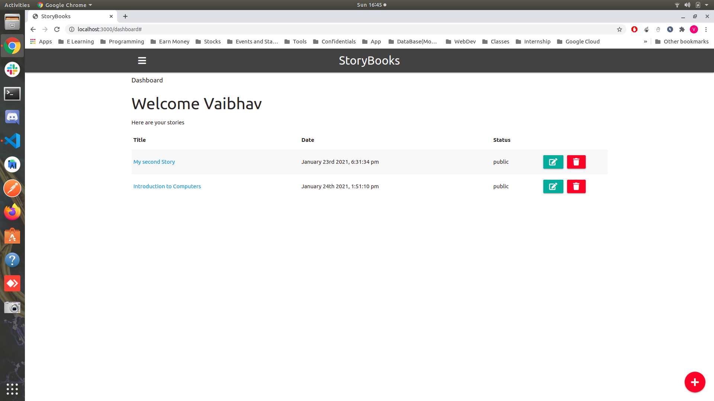

# StoryBooks

> Create public and private stories from your life

This app uses Node.js/Express/MongoDB with Google OAuth for authentication

## Screenshots
&nbsp; &nbsp;&nbsp; &nbsp;
&nbsp; &nbsp;&nbsp; &nbsp;
&nbsp; &nbsp;&nbsp; &nbsp;
&nbsp; &nbsp;&nbsp; &nbsp;
&nbsp; &nbsp;&nbsp; &nbsp;
&nbsp; &nbsp;&nbsp; &nbsp;
&nbsp; &nbsp;&nbsp; &nbsp;
&nbsp; &nbsp;&nbsp; &nbsp;

## Usage

Add your mongoDB URI and Google OAuth credentials to the config.env file

```
# Install dependencies
npm install

# Run in development
npm run dev

# Run in production
npm start
```